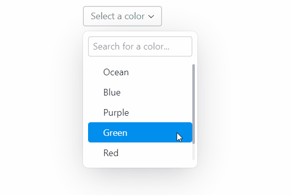
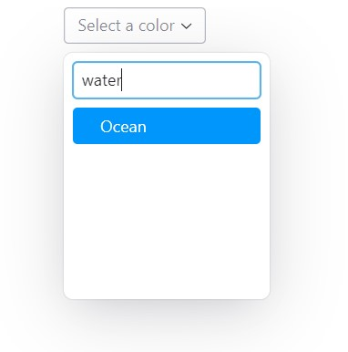

# Dynoselect

This is a select component for [Reflex](https://reflex.dev) that comes with a search bar 
and optionally allows the user to create non-existing options:



The following example shows how to use the component within a Reflex project:

```py
import reflex as rx
from reflex_dynoselect import dynoselect

options = [
    {"value": "ocean", "label": "Ocean"},
    {"value": "blue", "label": "Blue"},
    {"value": "purple", "label": "Purple"},
    {"value": "green", "label": "Green"},
    {"value": "red", "label": "Red"},
    {"value": "yellow", "label": "Yellow"},
]

class State(rx.State):
    """The app state."""
    pass

def index() -> rx.Component:
    return rx.center(
        rx.theme_panel(),
        dynoselect(
            options,
            placeholder="Select a color",
            search_placeholder="Search for a color",
        ),
    )

# Add state and page to the app.
app = rx.App()
app.add_page(index)
```

Options are given as a list of dictionaries. Each dictionary must contain a `label`
and a `value` key with strings as values. The `label` is displayed to the user while
the value key can be used for internal identifiers. Optionally, one can provide a 
`keywords` key to include alternative phrases that are included in the search but
not displayed to the user.

The `selected` attribute contains the complete dictionary of the currently selected 
option. In addition to the `value`, `label`, and `keywords` keys, one can add
arbitrary keys to the dictionary to store additional information about an option.

### Parameters
- `options`: A list of dictionaries containing the options. The dictionary
    must contain a `label` and a `value` key with strings as values. The value of the
    `label` key is displayed to the user while the `value` key can be used for internal
    identifiers. Optionally, one can provide a `keywords` key to include alternative 
    phrases that are included in the search but not displayed to the user. This is 
    intended to improve the search tolerance so that users can find options even 
    if synonyms are used. You may provide keywords either as a string or as a list
    of strings. For example, the option
    ```py
    {"value": "ocean", "label": "Ocean", "keywords": ["blue", "water"]}
    ```
    allows to input _"water"_ in order to search for the color _Ocean_ as shown below:

    
- `default_option`: The default option to select. By default, no option is
    selected.
- `placeholder`: The placeholder text that is shown when no option is selected.
- `search_placeholder`: The placeholder text for the search input field.
- `size`: Relative size of the component. Allowed values are "1", "2", and "3".
- `weight`: The weight of the text. Allowed values are "none", "light", 
    "regular", "medium", and "bold".
- `radius`: The edge radius of the component. Allowed values are "none",
    "small", "medium", "large", and "full".
- `height`: The height of the component menu. Can be given as a CSS value
    like "10rem" or "100%".
- `padding`: The padding around the border of the select menu.
- `indent`: The indentation of the select menu. If `align` is chosen to be
    "center", the indentation is applied horizontally to both sides and
    therefore acts as padding. Otherwise, it is applied to one side only
    and works as indentation.
- `align`: The alignment of the options. Allowed values are "left",
    "center", and "right".
- `create_option`: The option dictionary to create a new entry. If `create_option` is 
    None, the feature is deactivated. If the option is a dictionary, it determines the 
    `value` and `label` of the create option. You may either provide a static text
    or refer to the current search phrase by using "{}" as placeholder in the
    `label`. For example:
    ```py
    dynoselect(
        options,
        placeholder="Select a color",
        search_placeholder="Search for a color",
        create_option=dict(value="custom", label='Create new "{}"'),
    )
    ```
    The `label` given in the example above would be displayed as _Create new "Apple"_ if 
    the search phrase is _"Apple"_. Regarding the `value` key, you can use any 
    value you like.   
- `modal`: Directly passed on to PopoverRoot. If true, interaction on screen 
    readers with other elements is disabled and only popover content 
    is visible.
- `on_select`: Event handler that is called when the user selects an option. Note
    that the event handler is called even if the user selects the same value
    as before.

## Installation
The component has been tested without activating [Tailwind](https://tailwindcss.com/) 
explicitly. However, if the component looks strange, you may want to activate it as 
described in the [official documentation](https://reflex.dev/docs/styling/overview/#tailwind).

The component can be installed using the following command:
```bash
pip install reflex-dynoselect
```
